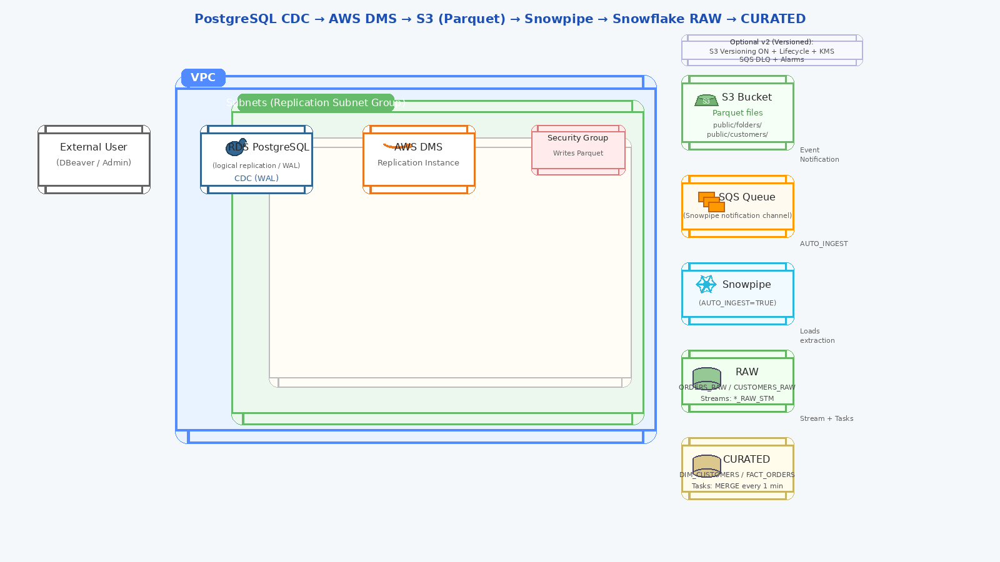

# AWS DMS → S3 → Snowflake CDC with Snowpipe

End-to-end Change Data Capture (CDC) pipeline from PostgreSQL to Snowflake using
AWS DMS, S3 (Parquet), Snowpipe, Streams, and Tasks.

## 📐 End-to-End Architecture

## Architecture Overview

This project demonstrates an end-to-end CDC pipeline that captures database changes from PostgreSQL and loads them into Snowflake using AWS services.

Pipeline Flow:

PostgreSQL (WAL / CDC)  
→ AWS DMS  
→ Amazon S3 (Parquet)  
→ Snowpipe (AUTO_INGEST)  
→ Snowflake RAW layer  
→ Streams + Tasks  
→ Curated dimensional models

## 🧠 Key Design Decisions

**1. Change Data Capture using PostgreSQL WAL**

PostgreSQL logical replication (WAL) is used to capture incremental database changes.  
This ensures that only changed records are processed without full table reloads.

**2. AWS DMS for CDC Replication**

AWS Database Migration Service replicates changes from PostgreSQL to Amazon S3 in Parquet format.

**3. Amazon S3 as Landing Zone**

S3 stores CDC data in Parquet format, improving compression and query efficiency.

**4. Snowpipe for Event-Driven Ingestion**

Snowpipe with AUTO_INGEST automatically loads new S3 files into Snowflake via SQS notifications.

**5. Raw Layer for Immutable Capture**

Incoming CDC data is first stored in RAW tables to preserve source integrity.

**6. Streams + Tasks for Incremental Processing**

Snowflake Streams track data changes and Tasks process incremental merges into curated tables.

**7. Curated Layer for Analytics**

Curated tables such as `DIM_CUSTOMERS` and `FACT_ORDERS` support downstream reporting and analytics.

# aws-dms-s3-snowflake-cdc-snowpipe
End-to-end CDC pipeline using AWS DMS, S3 Parquet, Snowpipe, and Snowflake Streams &amp; Tasks.

# aws-dms-s3-snowflake-cdc-snowpipe

End-to-end Change Data Capture (CDC) pipeline:
PostgreSQL (RDS) → AWS DMS (CDC) → S3 (Parquet) → Snowpipe (auto-ingest) → Snowflake RAW → Streams + Tasks (MERGE) → CURATED tables.

## Architecture
- Source: RDS PostgreSQL (logical replication enabled)
- Ingestion: AWS DMS (Full load + ongoing CDC)
- Landing: S3 Parquet (folders: public/customers, public/orders)
- Warehouse: Snowflake
  - External Stage + Parquet file format
  - Snowpipe for auto-ingest into RAW tables
  - Streams capture incremental changes
  - Tasks run deduped MERGE into CURATED tables

Mermaid diagram is in `architecture/architecture.mmd`.

## Data Model
### RAW
- `RAW.CUSTOMERS_RAW`
- `RAW.ORDERS_RAW`

### CURATED
- `CURATED.DIM_CUSTOMERS` (SCD1 upsert)
- `CURATED.FACT_ORDERS` (upsert)

## Key Production Learnings 
- Snowflake Streams only capture changes after stream creation → do one-time backfill for initial history.
- MERGE requires one source row per key → dedupe stream data using ROW_NUMBER() / QUALIFY.
- Snowpipe provides event-driven ingestion from S3 via SQS notifications.
- Least-privilege IAM role for Snowflake S3 read access (GetObject + ListBucket only).

## Setup Steps (High Level)
1. AWS:
   - Create RDS PostgreSQL and enable logical replication parameters.
   - Create DMS replication instance + source/target endpoints.
   - Create DMS task (Full load + CDC) to write Parquet to S3.
2. Snowflake:
   - Create Storage Integration (S3) + External Stage + Parquet file format.
   - Create RAW tables.
   - Create Snowpipe pipes for orders and customers (AUTO_INGEST=TRUE).
   - Create Streams on RAW tables.
   - Create Tasks that MERGE stream data into CURATED tables.
3. Validate:
   - Insert into Postgres → row appears in Snowflake RAW automatically (Snowpipe) → appears in CURATED automatically (Task MERGE).

## Validation (End-to-End)
- Insert new order in Postgres (DBeaver)
- Confirm it lands in:
  - `RAW.ORDERS_RAW` (Snowpipe)
  - `CURATED.FACT_ORDERS` (Task MERGE)
- Insert new customer in Postgres
- Confirm it lands in:
  - `RAW.CUSTOMERS_RAW`
  - `CURATED.DIM_CUSTOMERS`

See `sql/06_validation_queries.sql`.